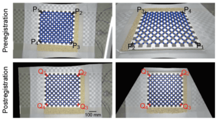
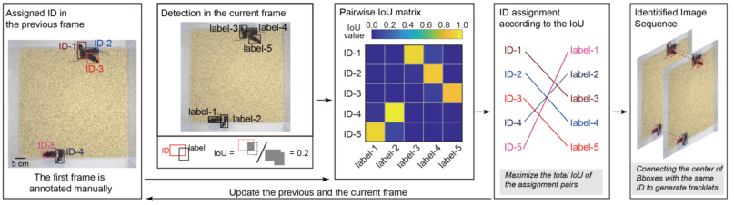

# Multi-Object Tracker for Mice (MOT-Mice)
**Keywords: Multi-object tracking, Multicamera, Mouse group, Deep learning, Object detection, Faster R-CNN, Tracklets fusion**  
Zhang Chen Lab, Peking University/Capital Medical University

## Introduction
Multi-Object Tracker for Mice (MOT-Mice) system uses the Faster R-CNN deep learning algorithm with geometric transformations in combination with multicamera/multi-image fusion technology to track individual unmarked mice.
MOT-Mice wsystem includes primary (a top-view) camera and auxiliary (multiple side-view) cameras.

## File description
***code***: Function liberary.   
***CameraCalibration***: Checkboard images and code used for camera calibration (***Download from cloud disk first***).  
***model***: Trained trace prediction model, and mouse detection models for mouse detection (***Download from cloud disk first***).  
***Videos of mouse group***: Multicamera videos of mouse group (***Download from cloud disk first***). Top-view camera: camera4. Side-view cameras: camera1,2,3.  
***imgs***: Descriptional images.   

## Configuration
Add folders ***code*** and ***model*** to search path in MATLAB.   
MOT-Mice was developed and tested on MATLAB R2019b using an Nvidia GeForce GTX 1080 Ti GPU with 11 GB memory.  

## Run the MOT-Mice system
#### Camera calibration
Processing the files in the folder of ***CameraCalibration***.  
Run ***CameraCalibration_V1.m*** to achieve camera calibration.  
 

#### Using Mouse detection (MOT-OD) and identity pairing (MOT-IP) modules to generate trackltes
Processing the files in the folder of ***Videos of mouse group***.  
Run ***Step1_MOT_ObjectDetect_IdPairing.m*** to detect all mouse individuals and generate tracklets.   
     
     

#### Using Trace prediction (MOT-TP) and MOT-Match modules for tracklets fusion
First, run ***Step2_MOT_SingleCameraFusion.m*** to fuse tracklets for each camera.   
Second, run ***Step3_MOT_MultiCameraFusion.m*** to fuse tracklets using multicamera.   
     
